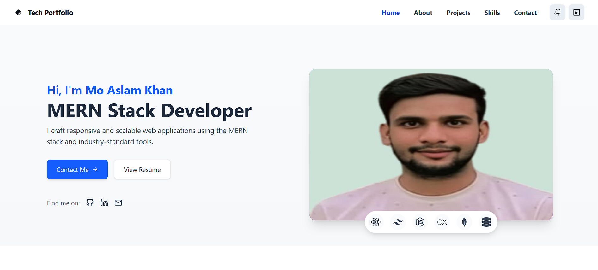
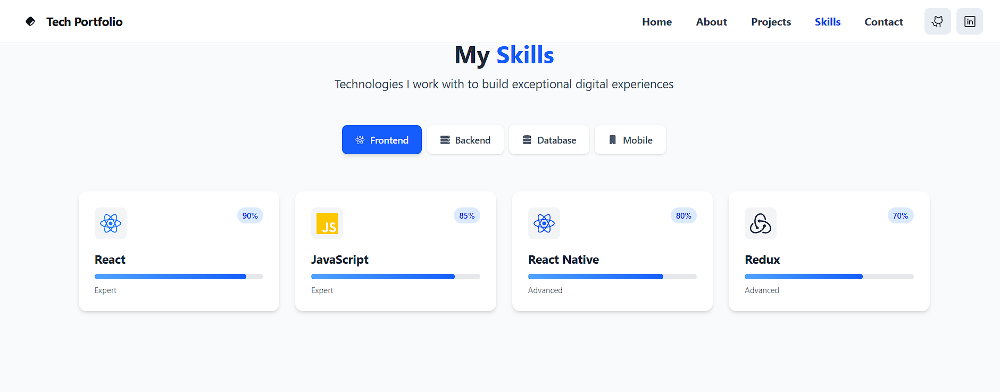
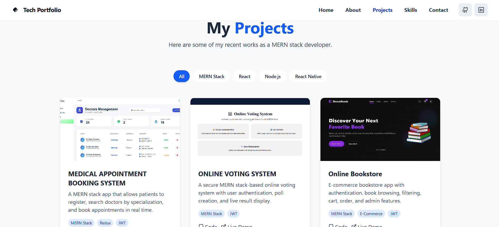
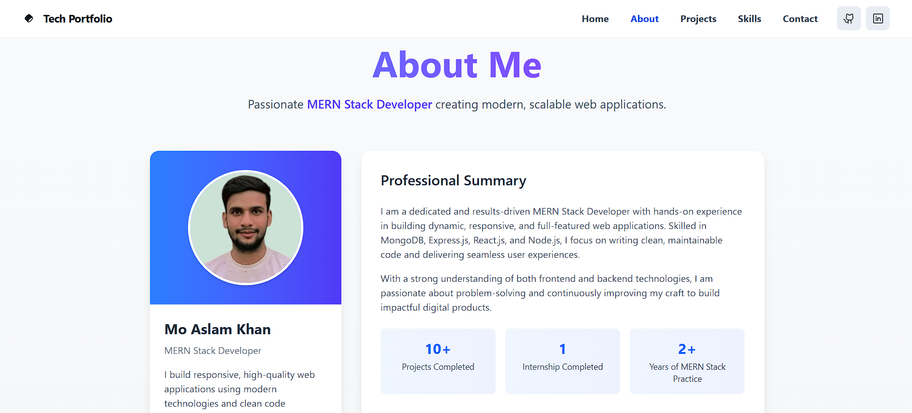
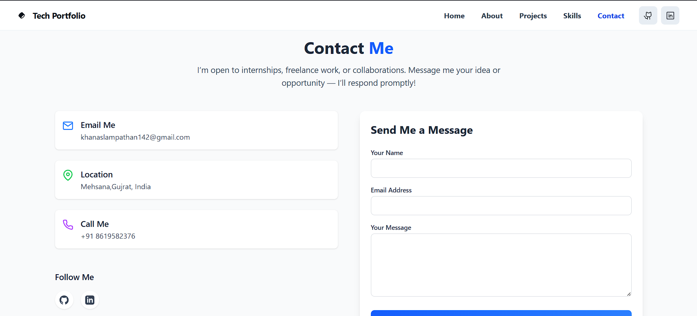

# Mo Aslam Khan - Portfolio

Welcome to my personal portfolio! This repository showcases my projects, skills, and experiences as a **MERN Stack & Frontend Developer**.

---

## 👨‍💻 About Me

Hi, I'm **Mo Aslam Khan**, a passionate **MERN Stack Developer** and frontend enthusiast. I build responsive and modern web applications with clean code and user-friendly interfaces.  
I also have experience in backend development using **Node.js**, **Express.js**, and **MongoDB**.

- 🌱 Currently learning advanced **React.js** concepts and building full-stack apps.
- 💻 Skilled in **HTML, CSS, JavaScript, React.js, Node.js, Express, MongoDB**.
- 🚀 I love creating web applications that solve real-world problems.
- 📫 Contact me at: **khanaslampathan@142gmail.com**

---

## 🛠 Skills

- **Frontend:** HTML, CSS, JavaScript, React.js, Tailwind CSS  
- **Backend:** Node.js, Express.js, REST APIs
- **Mobile Development:** React Native
- **Database:** MongoDB, Mongoose, SQL  
- **Tools & Platforms:** Git, GitHub, Vercel, Postman  

---

## 📂 Projects

### 1. Online Book Store
- **Description:** A full-stack MERN web app to browse, search, and add books to a cart.
- **Live Demo:** [Online Book Store](https://online-book-store-with-mern-stack.vercel.app/)  
- **Repo:** [GitHub Link](https://github.com/AslamKhanpathan142/online-book-store-with-mern-stack)

### 1. Online Voting System
- **Description:** A secure MERN stack-based online voting system with user authentication, poll creation, and live result display..
- **Live Demo:** [Online Book Store](https://online-voting-system-with-mern-stac.vercel.app/)  
- **Repo:** [GitHub Link](https://github.com/AslamKhanpathan142/online-voting-system-with-mern-stack)

### 2. Blog App
- **Description:** Users can create, read, and manage blogs. Includes user authentication.
- **Live Demo:** [Blog App](https://blog-app-with-mern-stack-ten.vercel.app/)  
- **Repo:** [GitHub Link](https://github.com/AslamKhanpathan142/blog-app-with-mern-stack)

### 3. Portfolio Website
- **Description:** My personal portfolio showcasing my projects and skills.
- **Live Demo:** [Portfolio](https://portfolio-vert-six-50.vercel.app/)  
- **Repo:** [GitHub Link](https://github.com/AslamKhanpathan142/portfolio)

---

## ⚡ How to Run Locally

1. **Clone the repository**  
```bash
git clone https://github.com/AslamKhanpathan142/portfolio.git
```

2. **Install dependencies**

```bash
cd portfolio
npm install
```

3. **Start the development server**

```bash
npm run dev
```

---

## 🖼 Screenshots

### Home Page


### Skill Page


### Projects Page


### About Page


### Contact Page


---

### 📫 Contact Me

- Email: khanaslampathan142@gmail.com

- LinkedIn: [LinkedIn](https://linkedin.com/in/mo-aslam-khan)

- GitHub: [GitHub](https://github.com/AslamKhanpathan142)

